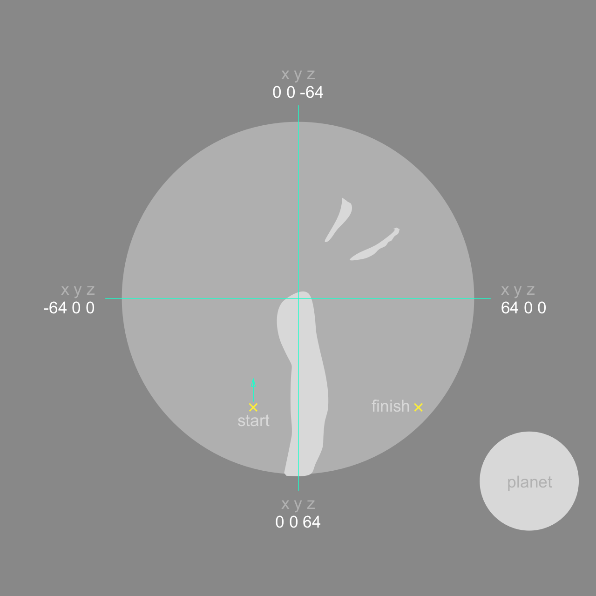

# Aeon

A prequel WebVR environment to videogame Aeon

## Map

## Local Installation and Development

- `git clone git@github.com:h0r0man/aeon.git` to download the project repository
- `cd aeon` to locate the project folder
- `npm install` to download all dependencies
- `gulp` to run workflow automatization
- `gulp deploy` to to publish contents to [Github pages](https://pages.github.com/)
